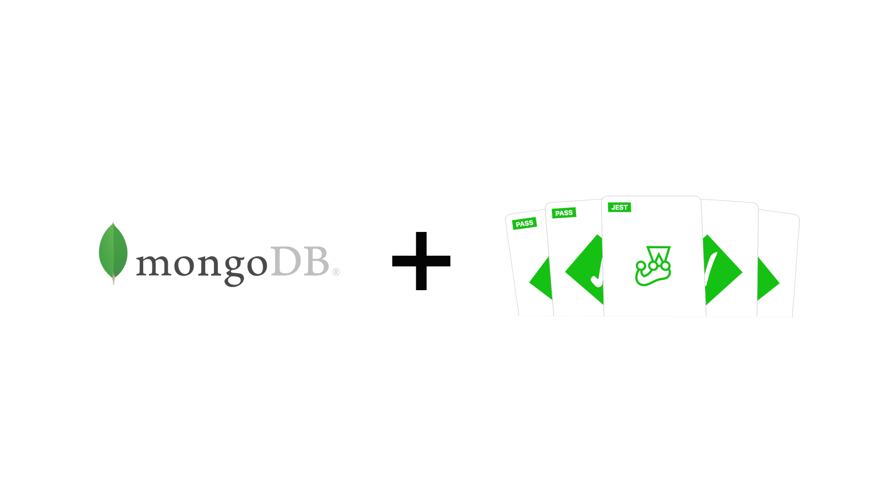

<h1 align="center">
    
</h1>
<h4 align="center">
   Desenvolvimento para automação de testes no Mongodb
</h4>

## Sobre
Esse projeto é um molde na criação de testes no Mongo, aqui você verá um CRUD de usuário para mais detalhes verifique o arquivo [UserController.ts](src/app/controllers/UserController.ts).

> *Note: O projeto contêm os scripts de `dev` e `build` esses scripts não estão configurados 100%, você terá configurá-los sozinho, hoje só está rodando o script de `test`.*

## :bulb: Instalação

Abaixe o projeto:

```shell
git https://github.com/thelokys/tests-with-mongodb.git # http
ou
git clone git@github.com:thelokys/tests-with-mongodb.git # ssh
ou
gh repo clone thelokys/tests-with-mongodb # cli
```
  
Utilize o seu gerenciador de pacotes preferido e depois instale suas dependecias:

```shell
npm install # NPM
ou
yarn install # YARN
```

## :rocket: Executando os testes no projeto

 Após a instalação rode o script de `test` com o seu gerenciador de pacotes. Os testes terá seus resultado mostrados no terminal.
 
 > *Para mais detalhes verifique o package.json*

## :package: Depedências

* [<code></code>](http://expressjs.com/) ExpressJS
* [<code></code>](https://mongoosejs.com/) Mongoose
* [<code></code>](https://jestjs.io/) Jest
* [<code></code>](https://www.typescriptlang.org/) Typescript

